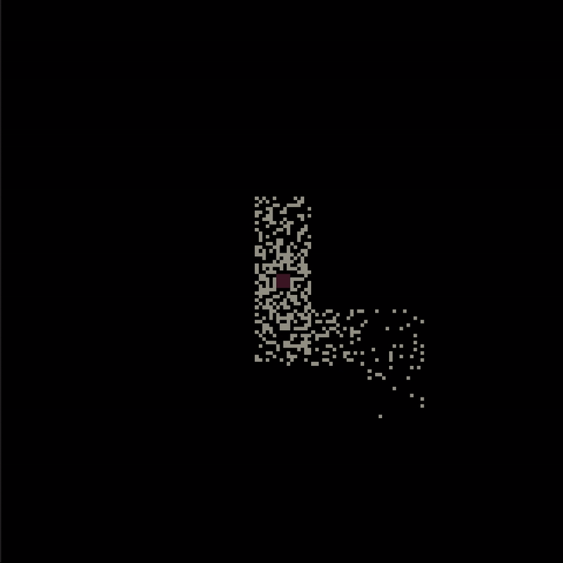

  

LO - small programming language targeting WASM that aims to be as simple as possible

<!-- TOC generated by `yzhang.markdown-all-in-one` VSCode extension -->

- [🏆 Goals](#-goals)
- [🪵 Development Log](#-development-log)
- [✍️ Documentation](#️-documentation)
- [👀 Examples](#-examples)
- [🚀 Getting started](#-getting-started)
- [🔦 VSCode extension](#-vscode-extension)
- [❔ More info](#-more-info)

## 🏆 Goals

- Make both the language and the compiler small and easy to understand
- Have little to no dependencies
- Be easy to use and modify
- Emit WASM to have the biggest target coverage with little code

## 🪵 Development Log

🧾 [Parts [0..6] - Building the initial compiler. (text based blog)](https://carrot-blog.deno.dev/?tag=lo)

📺 [Parts [7..] - Building the self-hosted compiler. (YouTube playlist)](https://youtube.com/playlist?list=PL6qyEx0ybzWqkc0zG6jVgRx63nZkdu3DP&si=X8OyuWQ8TNDrfikL)

## ✍️ Documentation

Documentation is available in [docs](./docs/README.md) folder.

## 👀 Examples

Check out example `.lo` programs including standard library sources and WIP self-hosted compiler in the [./examples](./examples/) folder.

Here are some of them with syntax highlighting from the [LO VS Code extension](#vscode-extension):

- Hello world [(source)](examples/test/demos/hello-world.lo):

- Advent of Code 2020 Day 1 [(source)](examples/test/demos/hello-world.lo):

- Dark Maze (WASM-4 demo game) [play it here](https://rawcdn.githack.com/glebbash/LO/da8305293f5438967619e91c6ecfd472111ccf91/examples/test/demos/wasm4/builds/dark-maze.html) or check the [source](examples/test/demos/wasm4/src/dark-maze.lo):

## 🚀 Getting started

1️⃣ Using VS Code extension (recommended)

> This option also works in vscode.dev

- Install the [LO VS Code extension](#vscode-extension)
- To create a new project: Open empty folder, execute Command Palette: `LO: Initialize project in current workspace`
- To run currently open file: execute Command Palette: `LO: Run current file`, or press ▶️ button in the top toolbar
- Compiling files:
  - Open Web Shell: execute Command Palette: `Terminal: Create New Web Shell`
  - Run: `run lo.wasm <input>.lo > <output>.wasm`

---

2️⃣ Using wasmtime

- Install [wasmtime](https://github.com/bytecodealliance/wasmtime)
- Compiling files: `wasmtime --dir=. lo.wasm <input>.lo > <output>.wasm`
- Getting diagnostics (in json format): `wasmtime --dir=. lo.wasm <input>.lo --inspect`

---

3️⃣ Using Node.js

- Install [Node.js](https://github.com/bytecodealliance/wasmtime)
- Compiling files: `./utils.mjs compile <input>.lo > <output>.wasm`
- Compiling & running files: `./utils.mjs run <input>.lo`

---

> Additional info on compiler usage is in the [docs](./docs/README.md)

## 🔦 VSCode extension

Available on:
- [Visual Studio Marketplace](https://marketplace.visualstudio.com/items?itemName=glebbash.lo)
- [Open VSX Registry](https://open-vsx.org/extension/glebbash/lo)

> See [Inspection](./docs/README.md#52-inspecting-code-ide-intergration) if you are interested in intergrating with other IDEs

## ❔ More info

More info including building initial compiler and running tests is available in the [docs](./docs/README.md)
